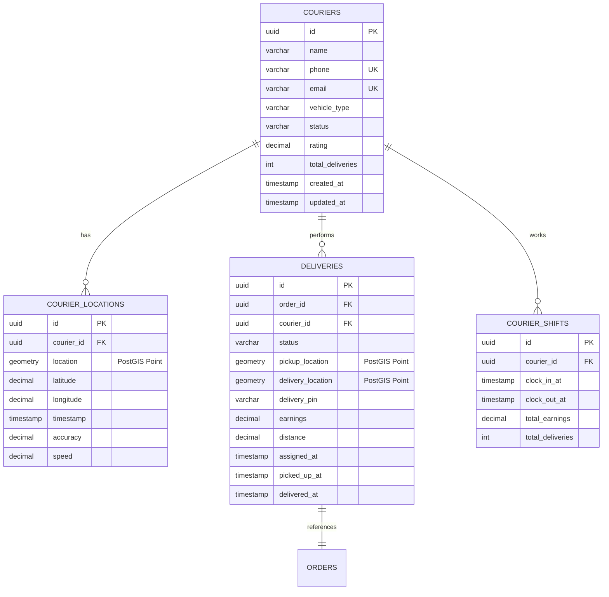
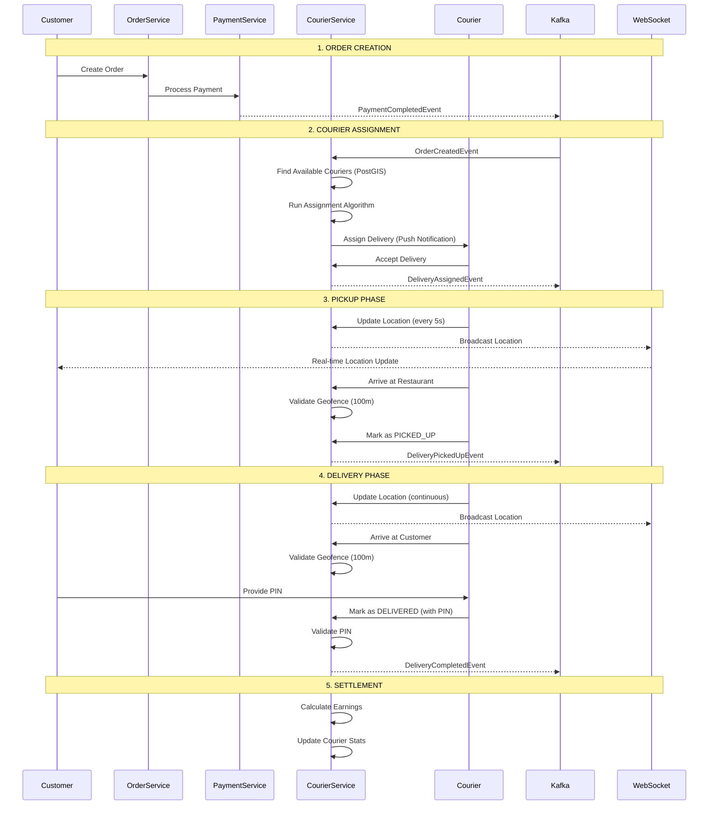
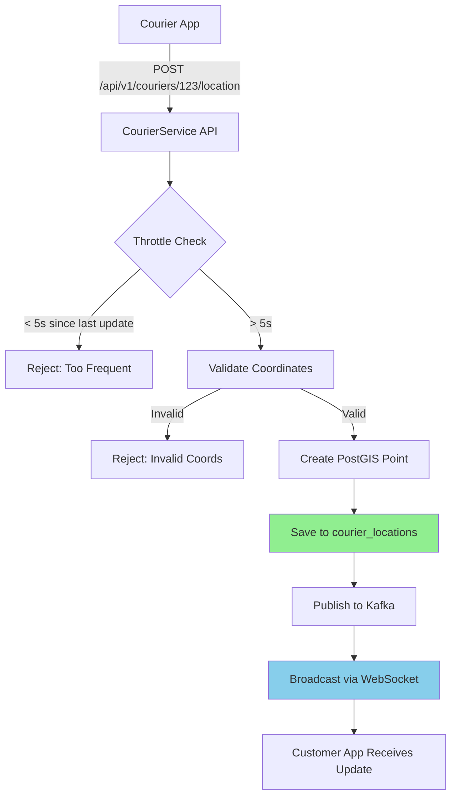
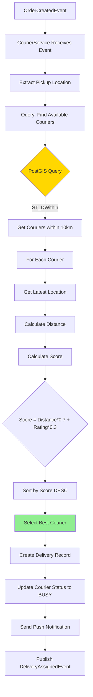
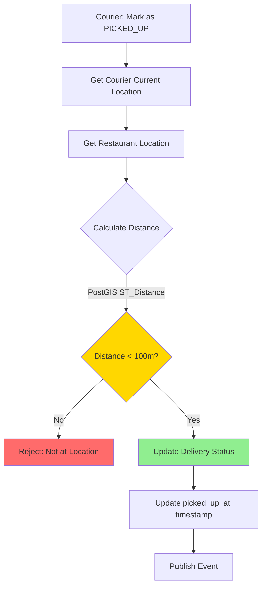
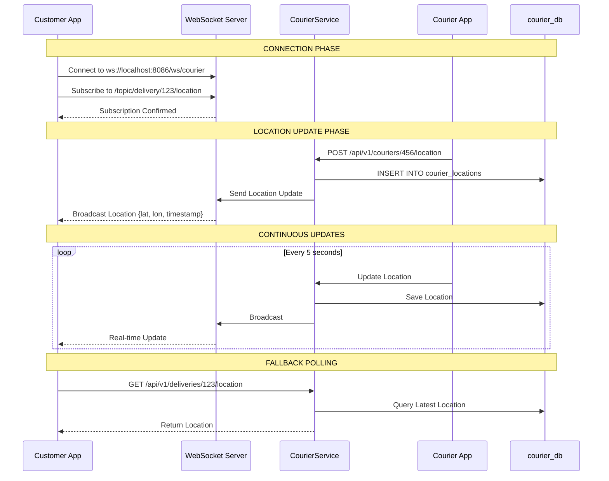
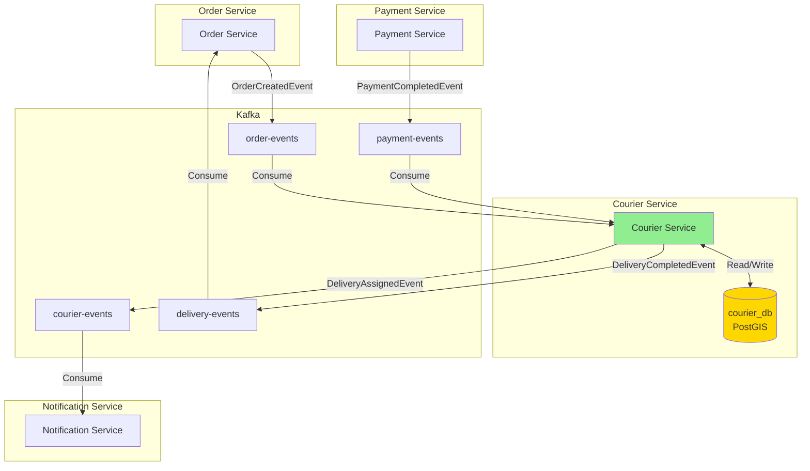

# Courier Service - System Flow & Database Architecture

## 🎯 Overview

Este documento describe el flujo completo del sistema de repartidores (Courier Service), incluyendo las interacciones entre servicios, el uso de bases de datos, y los flujos de datos en tiempo real.

---

## 🗄️ Database Architecture

### Database: `courier_db`

El Courier Service utiliza PostgreSQL con la extensión **PostGIS** para capacidades geoespaciales.

#### Tablas Principales



---

### PostGIS Spatial Indexes

```sql
-- Índice espacial para búsquedas geográficas rápidas
CREATE INDEX idx_courier_location_spatial 
ON courier_locations USING GIST(location);

-- Índice para búsquedas temporales
CREATE INDEX idx_courier_location_timestamp 
ON courier_locations(timestamp DESC);
```

**Beneficios:**
- Búsquedas de "couriers en radio de 5km" en < 50ms
- Soporte para queries espaciales complejas
- Cálculos de distancia optimizados

---

## 🔄 Complete System Flow

### End-to-End Delivery Flow



---

## 🗺️ Geolocation Flow

### 1. Location Update Flow



**Database Operation:**
```sql
INSERT INTO courier_locations (courier_id, location, latitude, longitude, timestamp)
VALUES (
    '123e4567-...',
    ST_SetSRID(ST_MakePoint(-77.0428, -12.0464), 4326),  -- PostGIS Point
    -12.0464,
    -77.0428,
    NOW()
);
```

---

### 2. Courier Assignment Flow



**PostGIS Query:**
```sql
SELECT c.*, cl.location, cl.latitude, cl.longitude,
       ST_Distance(
           cl.location::geography,
           ST_SetSRID(ST_MakePoint(-77.0428, -12.0464), 4326)::geography
       ) / 1000 as distance_km
FROM couriers c
INNER JOIN LATERAL (
    SELECT * FROM courier_locations
    WHERE courier_id = c.id
    ORDER BY timestamp DESC
    LIMIT 1
) cl ON true
WHERE c.status = 'AVAILABLE'
  AND ST_DWithin(
      cl.location::geography,
      ST_SetSRID(ST_MakePoint(-77.0428, -12.0464), 4326)::geography,
      10000  -- 10km radius
  )
ORDER BY distance_km ASC;
```

---

### 3. Geofencing Validation Flow



**Geofencing Query:**
```sql
SELECT ST_Distance(
    (SELECT location FROM courier_locations 
     WHERE courier_id = :courierId 
     ORDER BY timestamp DESC LIMIT 1)::geography,
    (SELECT pickup_location FROM deliveries 
     WHERE id = :deliveryId)::geography
) < 100 as is_at_location;
```

---

## 📡 Real-Time Tracking Architecture

### WebSocket Communication Flow



---

## 🔄 Service Interactions

### Microservices Communication



---

## 📊 Data Flow Examples

### Example 1: Complete Delivery Lifecycle

**Initial State:**
```sql
-- Courier is AVAILABLE
SELECT * FROM couriers WHERE id = 'courier-123';
-- status = 'AVAILABLE', total_deliveries = 45, rating = 4.8

-- Latest location
SELECT * FROM courier_locations 
WHERE courier_id = 'courier-123' 
ORDER BY timestamp DESC LIMIT 1;
-- lat = -12.0464, lon = -77.0428, timestamp = 2026-01-30 10:00:00
```

**Step 1: Order Created → Courier Assigned**
```sql
-- New delivery created
INSERT INTO deliveries (id, order_id, status, pickup_location, delivery_location, delivery_pin)
VALUES (
    'delivery-456',
    'order-789',
    'ASSIGNED',
    ST_SetSRID(ST_MakePoint(-77.0428, -12.0464), 4326),  -- Restaurant
    ST_SetSRID(ST_MakePoint(-77.0500, -12.0500), 4326),  -- Customer
    '123456'
);

-- Update courier status
UPDATE couriers 
SET status = 'BUSY' 
WHERE id = 'courier-123';

-- Assign courier to delivery
UPDATE deliveries 
SET courier_id = 'courier-123', assigned_at = NOW() 
WHERE id = 'delivery-456';
```

**Step 2: Courier Updates Location (continuous)**
```sql
-- Every 5 seconds
INSERT INTO courier_locations (courier_id, location, latitude, longitude, timestamp)
VALUES (
    'courier-123',
    ST_SetSRID(ST_MakePoint(-77.0430, -12.0465), 4326),
    -12.0465,
    -77.0430,
    NOW()
);
```

**Step 3: Courier Arrives at Restaurant**
```sql
-- Validate geofence
SELECT ST_Distance(
    ST_SetSRID(ST_MakePoint(-77.0428, -12.0464), 4326)::geography,  -- Restaurant
    (SELECT location FROM courier_locations 
     WHERE courier_id = 'courier-123' 
     ORDER BY timestamp DESC LIMIT 1)::geography
) < 100 as can_pickup;
-- Returns: true

-- Update delivery status
UPDATE deliveries 
SET status = 'PICKED_UP', picked_up_at = NOW() 
WHERE id = 'delivery-456';
```

**Step 4: Courier Delivers Order**
```sql
-- Validate geofence at customer location
SELECT ST_Distance(
    ST_SetSRID(ST_MakePoint(-77.0500, -12.0500), 4326)::geography,  -- Customer
    (SELECT location FROM courier_locations 
     WHERE courier_id = 'courier-123' 
     ORDER BY timestamp DESC LIMIT 1)::geography
) < 100 as can_deliver;
-- Returns: true

-- Validate PIN
SELECT delivery_pin = '123456' as pin_valid 
FROM deliveries 
WHERE id = 'delivery-456';
-- Returns: true

-- Calculate distance
UPDATE deliveries 
SET 
    status = 'DELIVERED',
    delivered_at = NOW(),
    distance = ST_Distance(pickup_location::geography, delivery_location::geography) / 1000,
    earnings = 15.00  -- Base fare + distance
WHERE id = 'delivery-456';

-- Update courier stats
UPDATE couriers 
SET 
    status = 'AVAILABLE',
    total_deliveries = total_deliveries + 1,
    rating = (rating * total_deliveries + 5.0) / (total_deliveries + 1)
WHERE id = 'courier-123';
```

---

## 🎯 Key Database Queries

### 1. Find Nearest Available Couriers

```sql
WITH latest_locations AS (
    SELECT DISTINCT ON (courier_id) 
        courier_id, location, timestamp
    FROM courier_locations
    ORDER BY courier_id, timestamp DESC
)
SELECT 
    c.id,
    c.name,
    c.rating,
    c.vehicle_type,
    ll.location,
    ST_Distance(
        ll.location::geography,
        ST_SetSRID(ST_MakePoint(:pickup_lon, :pickup_lat), 4326)::geography
    ) / 1000 as distance_km
FROM couriers c
INNER JOIN latest_locations ll ON ll.courier_id = c.id
WHERE c.status = 'AVAILABLE'
  AND ST_DWithin(
      ll.location::geography,
      ST_SetSRID(ST_MakePoint(:pickup_lon, :pickup_lat), 4326)::geography,
      10000  -- 10km
  )
ORDER BY distance_km ASC
LIMIT 10;
```

---

### 2. Get Courier Location History

```sql
SELECT 
    latitude,
    longitude,
    timestamp,
    speed,
    ST_AsGeoJSON(location) as geojson
FROM courier_locations
WHERE courier_id = :courier_id
  AND timestamp >= NOW() - INTERVAL '1 hour'
ORDER BY timestamp ASC;
```

---

### 3. Calculate Delivery Statistics

```sql
SELECT 
    c.id,
    c.name,
    COUNT(d.id) as total_deliveries,
    AVG(d.distance) as avg_distance_km,
    SUM(d.earnings) as total_earnings,
    AVG(EXTRACT(EPOCH FROM (d.delivered_at - d.assigned_at)) / 60) as avg_delivery_time_minutes
FROM couriers c
LEFT JOIN deliveries d ON d.courier_id = c.id
WHERE d.status = 'DELIVERED'
  AND d.delivered_at >= CURRENT_DATE
GROUP BY c.id, c.name
ORDER BY total_earnings DESC;
```

---

## 🔐 Security & Performance

### Rate Limiting

**Location Updates:**
- Maximum 1 update per 5 seconds per courier
- Implemented via Redis cache with TTL

```java
@RateLimiter(name = "location-updates", fallbackMethod = "locationUpdateFallback")
public void updateLocation(UUID courierId, LocationUpdateRequest request) {
    // Implementation
}
```

---

### Database Optimization

**Indexes:**
```sql
-- Spatial index (GIST)
CREATE INDEX idx_courier_location_spatial ON courier_locations USING GIST(location);

-- Composite index for courier status queries
CREATE INDEX idx_courier_status_rating ON couriers(status, rating DESC);

-- Temporal index for recent locations
CREATE INDEX idx_location_recent ON courier_locations(courier_id, timestamp DESC);
```

**Partitioning:**
```sql
-- Partition courier_locations by month (for historical data)
CREATE TABLE courier_locations_2026_01 PARTITION OF courier_locations
FOR VALUES FROM ('2026-01-01') TO ('2026-02-01');
```

---

## 📈 Monitoring & Observability

### Key Metrics

1. **Geospatial Queries:**
   - Average query time for "find nearby couriers"
   - 95th percentile < 100ms

2. **WebSocket Connections:**
   - Active connections count
   - Message throughput (messages/sec)

3. **Assignment Algorithm:**
   - Time to assign courier
   - Assignment success rate

4. **Database:**
   - PostGIS query performance
   - Index usage statistics
   - Table sizes and growth

---

## 🎯 Summary

### Database Usage

| Table | Purpose | Key Features |
|-------|---------|--------------|
| `couriers` | Courier profiles | Status, rating, vehicle type |
| `courier_locations` | GPS tracking | PostGIS Point, spatial index |
| `deliveries` | Delivery records | Status, earnings, PIN |
| `courier_shifts` | Work sessions | Clock in/out, earnings |

### Service Interactions

1. **Order Service** → Courier Service: Order created
2. **Courier Service** → Notification Service: Delivery assigned
3. **Courier Service** → WebSocket: Real-time location
4. **Courier App** → Courier Service: Location updates

### Data Flow

1. Location updates saved to `courier_locations`
2. PostGIS queries find nearest couriers
3. Assignment algorithm selects best match
4. Delivery lifecycle tracked in `deliveries`
5. Real-time updates via WebSocket
6. Events published to Kafka

---

**Estado:** Listo para implementación 🚀
