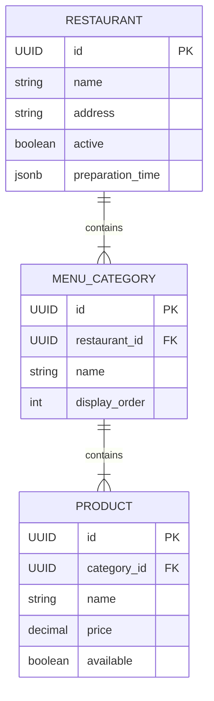
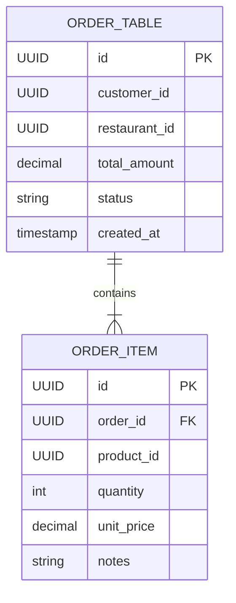
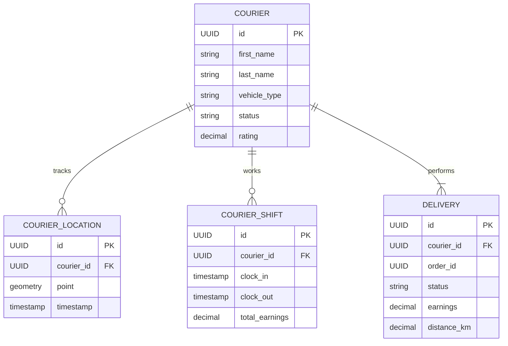
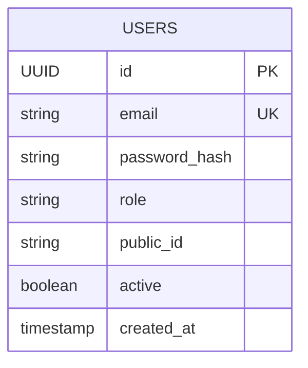

# Diseño de Base de Datos - FoodRush

Este documento detalla los esquemas de base de datos de los microservicios principales.

## 1. Restaurant Service (`restaurant_db`)
Gestiona la información estática y operativa de los restaurantes.

## 2. Order Service (`order_db`)
Núcleo transaccional. Máquina de estados del pedido.

* **Estados de Pedido:** `PENDING_PAYMENT` -> `PAID` -> `CONFIRMED` -> `PREPARING` -> `READY_FOR_PICKUP` -> `PICKED_UP` -> `DELIVERED` (o `CANCELLED`).

## 3. Courier Service (`courier_db`)
Logística y posicionamiento geoespacial.

## 4. Auth Service (`auth_db`) - *Planificado*
Gestión de identidad.

