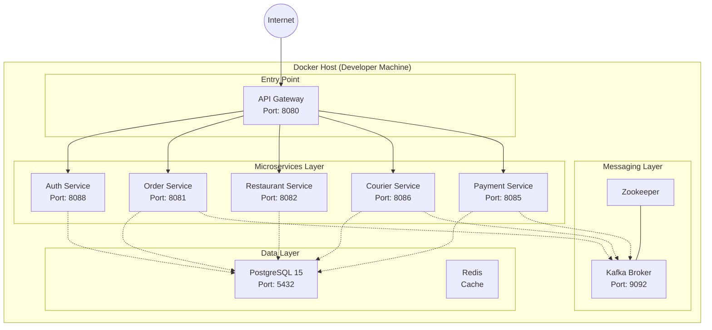

# Vista de Despliegue - FoodRush

## Infraestructura Local con Docker Compose

El entorno de ejecución local utiliza contenedores Docker orquestados. Todos los servicios comparten una red interna `foodrush-network` para comunicación DNS.

## Requisitos de Hardware
*   **CPU:** Mínimo 4 Núcleos (para levantar todos los microservicios JVM).
*   **RAM:** Mínimo 8GB, recomendado 16GB.
*   **Espacio e Disco:** ~2GB (Imágenes Docker + Volúmenes DB).

## Variables de Entorno Clave
Cada servicio se configura mediante `spring.profiles.active=docker` cuando corre en contenedor.

| Servicio | Variable | Propósito |
| :--- | :--- | :--- |
| Gateway | `AUTH_SERVICE_URI` | URL del servicio de autenticación para validación |
| Todos | `DB_HOST` | Host de la base de datos (nombre de servicio docker) |
| Todos | `KAFKA_BOOTSTRAP_SERVERS` | `kafka:9092` |
