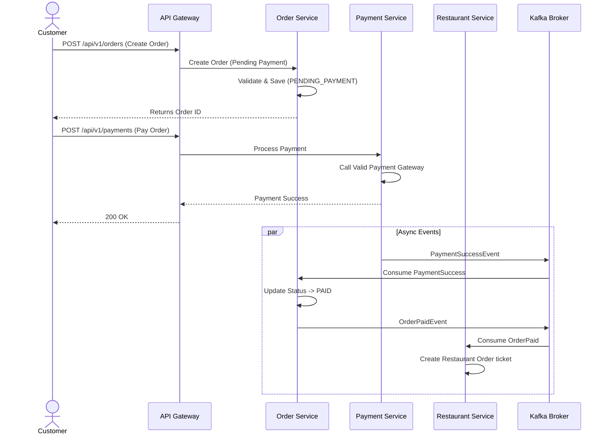
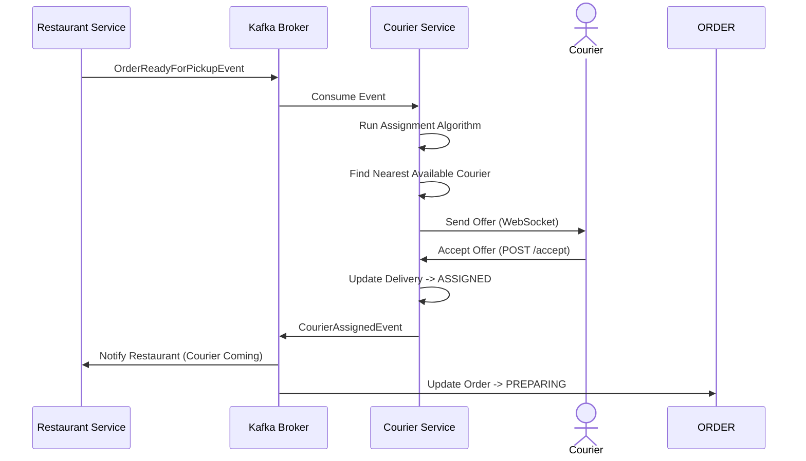

# Diagramas de Secuencia - FoodRush

## 1. Flujo "Happy Path": Pedido Exitoso

Diagrama que muestra la interacción entre el Cliente, y los microservicios principales desde que se crea el pedido hasta que se confirma.

## 2. Flujo de Asignación de Repartidor

Como el sistema selecciona un courier automáticamente tras la aceptación del restaurante.

