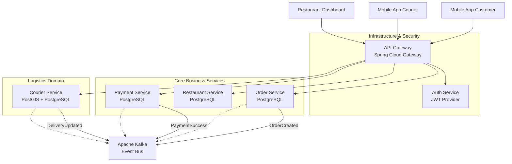

# Arquitectura Técnica - FoodRush

## 1. Visión General de Arquitectura
FoodRush sigue una arquitectura de **Microservicios** basada en eventos (Event-Driven Architecture), utilizando **Java Spring Boot** como framework principal.

### ¿Por qué Microservicios?
*   **Escalabilidad Independiente:** Permite escalar el `Order Service` (alto tráfico de lectura/escritura) independientemente del `Restaurant Service` (mayormente lectura).
*   **Desacoplamiento:** Fallos en el módulo de pagos no detienen la navegación del catálogo.
*   **Tecnologías Específicas:** Permite usar PostGIS específicamente para el `Courier Service` sin obligar a usarlo en los demás.

## 2. Diagrama de Componentes (C4 Nivel 2)

## 3. Patrones de Diseño
*   **Arquitectura Hexagonal (Ports & Adapters):** Cada microservicio aísla su lógica de dominio del framework y la base de datos.
*   **Saga Pattern (Coreografía):** Para transacciones distribuidas (ej. Crear Pedido -> Reservar Pago -> Asignar Courier). Si algo falla, se disparan eventos compensatorios.
*   **API Gateway:** Punto único de entrada para routing, rate limiting y validación de seguridad inicial.
*   **CQRS (Light):** Separación lógica de comandos (escritura) y queries (lectura), optimizado en algunos servicios.

## 4. Stack Tecnológico

| Capa | Tecnología | Justificación |
| :--- | :--- | :--- |
| **Lenguaje** | Java 17 | Robustez, tipado fuerte y ecosistema maduro. |
| **Framework** | Spring Boot 3 | Estándar de industria, facilidad de configuración y Cloud Native. |
| **Base de Datos** | PostgreSQL 15 | Relacional, sólida y extensible (PostGIS). |
| **Messaging** | Apache Kafka | Alto throughput para eventos de pedidos y tracking. |
| **Routing** | Spring Cloud Gateway | Integración nativa con ecosistema Spring. |
| **Seguridad** | JWT + Spring Security | Stateless authentication, ideal para microservicios. |
| **Tracking** | Spring WebSockets (STOMP) | Comunicación bidireccional eficiente para ubicación en tiempo real. |

## 5. Decisiones Clave de Arquitectura

### A. Base de Datos por Servicio
Cada microservicio tiene su propio esquema de base de datos (`order_db`, `courier_db`, etc.) para garantizar desacoplamiento total. No hay joins entre bases de datos; la consistencia se maneja vía eventos.

### B. Comunicación Asíncrona
Se prioriza Kafka para notificar cambios de estado (ej. cuando se paga un pedido, `Order Service` no llama a `Restaurant Service` directamente, sino que publica un evento). Esto reduce latencia y acoplamiento temporal.

### C. Estrategia de Despliegue
Contenedores Docker orquestados (inicialmente Docker Compose, preparado para Kubernetes). Configuración centralizada vía variables de entorno.
