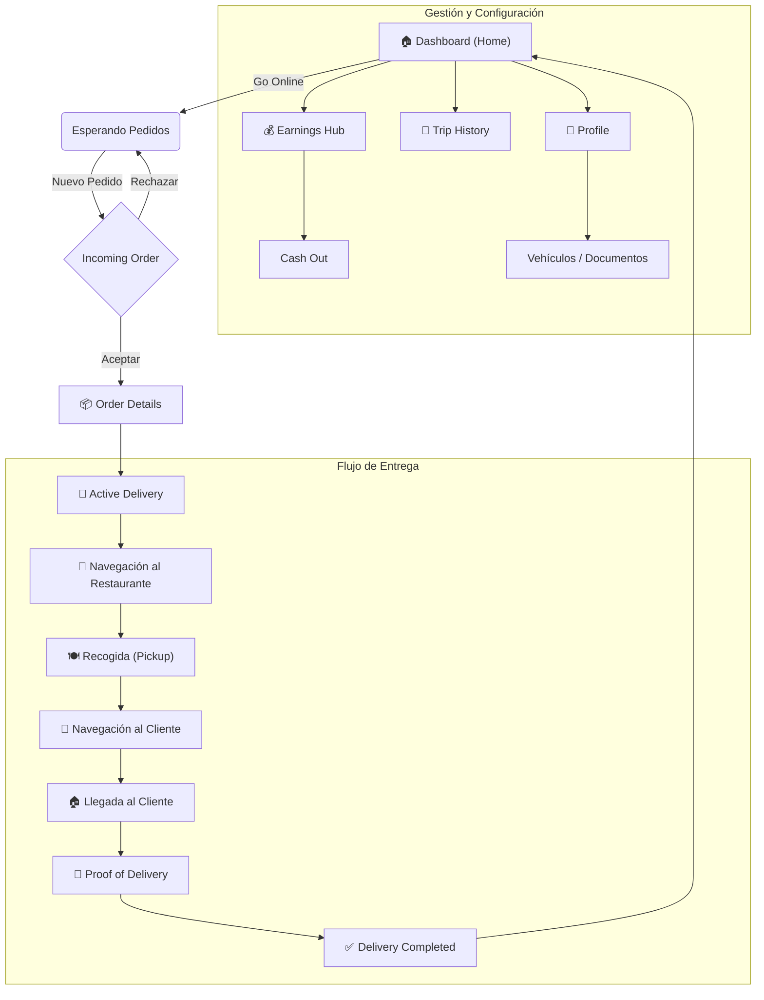

# 🚴‍♂️ Módulo Courier - EatVibe

Bienvenido a la documentación central del módulo de repartidores (**Courier**) de EatVibe Mobile. Este repositorio contiene toda la estructura, flujos y definiciones de las pantallas implementadas para la gestión de entregas.

---

## 🏗️ Estructura del Proyecto

El módulo de Courier se encuentra bajo `src/app/(courier)/` y utiliza **Expo Router** para la navegación basada en archivos.

```bash
src/app/(courier)/
├── _layout.tsx              # Configuración del Tab Navigator principal (Home, Earnings, Trips, Profile)
├── dashboard/               # 🏠 Home Screen (Inicio, estado online/offline, mapa de calor)
├── delivery/                # 🚀 Flujo Activo de Entrega
│   ├── active.tsx           # Seguimiento en tiempo real (mapa, ruta)
│   ├── navigate.tsx         # Navegación detallada
│   ├── proof.tsx            # Captura de prueba de entrega (PIN/Foto)
│   ├── completed.tsx        # Resumen de entrega finalizada
│   ├── contact-customer.tsx # Chat/Llamada con cliente
│   ├── contact-restaurant.tsx # Chat/Llamada con restaurante
│   └── report-issue.tsx     # Reporte de incidencias
├── order/                   # 📦 Gestión de Pedidos Entrantes
│   ├── incoming.tsx         # Notificación de nuevo pedido (Aceptar/Rechazar)
│   └── [id].tsx             # Detalles del pedido antes de aceptar
├── earnings/                # 💰 Gestión Financiera
│   ├── index.tsx            # Dashboard de ganancias
│   ├── history.tsx          # Historial de transacciones
│   └── cash-out.tsx         # Retiro de fondos
├── trips/                   # 📜 Historial de Viajes
│   ├── index.tsx            # Lista de viajes realizados
│   └── [id].tsx             # Detalle de un viaje específico
├── profile/                 # 👤 Perfil y Configuración
│   ├── index.tsx            # Menú principal de perfil
│   ├── vehicle.tsx          # Gestión de vehículos
│   ├── documents.tsx        # Documentos legales y licencias
│   ├── bank.tsx             # Datos bancarios
│   └── settings.tsx         # Preferencias de la aplicación
└── support/                 # 🆘 Soporte y Ayuda
    └── index.tsx            # Centro de ayuda
```

---

## 🔄 Flujo de Navegación Principal

El siguiente diagrama describe cómo el usuario interactúa con la aplicación durante un ciclo típico de entrega y gestión:



---

## ✅ Pantallas Implementadas

Actualmente, el módulo cuenta con las siguientes pantallas totalmente funcionales (UI):

### 1. Core Loop (Entrega)
- **Incoming Order**: Pantalla de alerta con timer para aceptar pedidos.
- **Active Delivery**: Mapa en tiempo real con estados del pedido.
- **Navigation**: Interfaz de navegación paso a paso.
- **Proof of Delivery**: Validación de entrega mediante PIN o foto.
- **Delivery Completed**: Resumen de ganancias y éxito del pedido.
- **Contact Screens**: Comunicación con Cliente y Restaurante.
- **Report Issue**: Flujo para reportar problemas.

### 2. Finanzas (Earnings)
- **Earnings Hub**: Gráficas de ingresos semanales y balance actual.
- **Transaction History**: Lista detallada de pagos y bonos.
- **Cash Out**: Funcionalidad para solicitar transferencias inmediatas.

### 3. Historial (Trips)
- **Trips List**: Historial de pedidos completados filtrados por fecha.
- **Trip Details**: Desglose completo de un pedido pasado (ruta, pago, tiempos).

### 4. Perfil (Profile)
- **Profile Dashboard**: Vista general del usuario y estadísticas.
- **My Vehicle**: Registro y edición de vehículos.
- **Documents**: Estado de validez de licencias y seguros.
- **Bank Details**: Gestión de cuentas para depósitos.
- **App Settings**: Preferencias de notificaciones y navegación.

---
